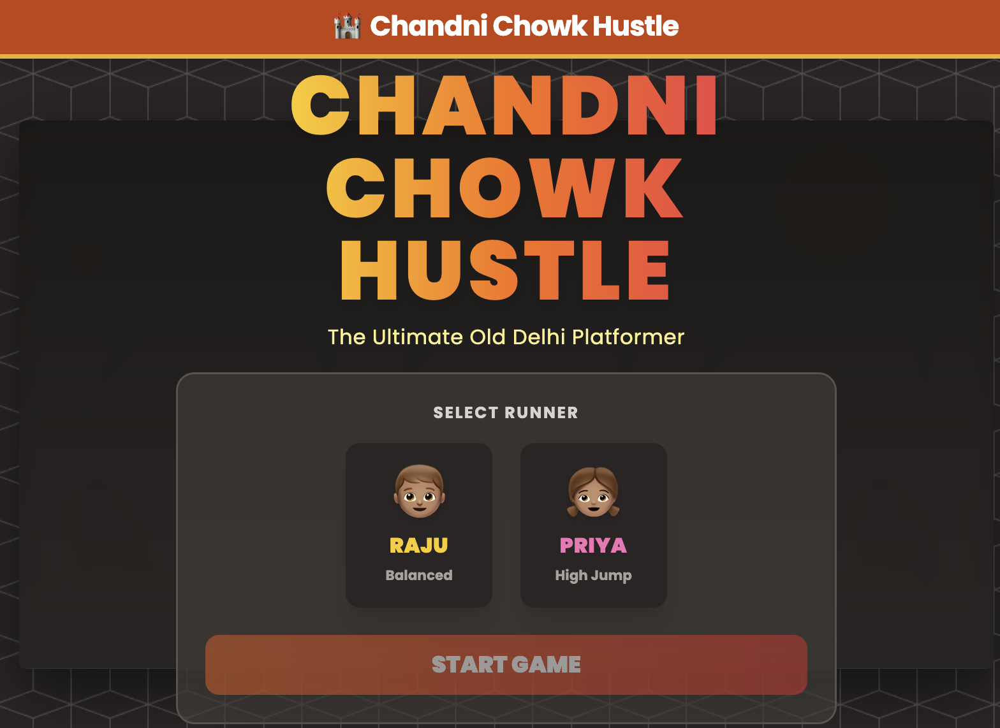

# 🏰 Chandni Chowk Hustle: Deluxe Edition

> *The Ultimate Old Delhi Platformer!*

Welcome to the chaotic, colorful, and deliciously dangerous streets of Old Delhi! **Chandni Chowk Hustle** is a high-octane endless runner (well, until the Red Fort) where you dodge rickshaws, outsmart monkeys, and grab as many samosas as you can!

### [🎮 Play Now on chandni-chowk-bros.com](https://chandni-chowk-bros.com/)

## 🎮 How to Play

Your goal is simple: **Run. Jump. Eat.**  
Avoid the obstacles and reach the Red Fort to become the **Chandni Chowk Champion**!

### Controls

| Action | Keyboard | Touch (Mobile) |
| :--- | :--- | :--- |
| **Move Left** | `Arrow Left` | Tap ⬅️ Button |
| **Move Right** | `Arrow Right` | Tap ➡️ Button |
| **Jump** | `Space` or `Arrow Up` | Tap **JUMP** / Tap Screen |
| **Slide** | `Arrow Down` | Tap **SLIDE** |
| **Dash** | `Shift` | Tap **DASH** |

## 🌟 Features

### 🏃🏽‍♂️ Choose Your Runner
- **Raju**: The balanced hustler. Reliable and quick.
- **Priya**: The high-jumping prodigy. Reaches those top-shelf jalebis!

### 🗺️ The Galis (Levels)
1.  **The Market**: Avoid the morning rush of rickshaws!
2.  **Paranthe Wali Gali**: Slippery oil and hungry cows ahead!
3.  **Kinari Bazaar**: Jump on cloth stalls to stay safe.
4.  **Rooftops**: Monkey menace! Dodge the flying bananas! 🍌
5.  **Red Fort**: The final sprint involved. Don't stop now!

### 🏆 Competition & Glory
- **Local Leaderboard**: Your top scores are saved locally. Can you make it to the Wall of Fame?
- **Score Aggregation**: Your score piles up as you progress through levels. Don't lose it all!
- **Star Rating**: Rate your run (1-5 ⭐) and share your experience!
- **Victory Screen**: defeat the Monkey King in Level 5 to see the true ending.

### 🛑 Obstacles & Enemies
- **Rickshaws**: They don't stop for anyone. Jump over them!
- **Cows**: They might be holy, but they block the way.
- **Monkeys**: They throw bananas. Seriously.
- **Pigeons**: They... are just there. Menacingly.

### 🥟 Power-ups & Scoring
- **Samosas & Gulab Jamuns**: Tasty points! 😋
- **Chai**: Fuel for the soul (and score).
- **Hearts**: You have 5 lives. Don't waste them!

## 🚀 Installation & Running

No complex setup needed! This is a vanilla HTML/JS game.

1.  Clone this repo.
2.  Open `index.html` in your favorite web browser.
3.  **HUSTLE!**

---
*Made with ❤️ and too much chai.*
